# Mini Project & Use Cases 

This repository contains projects developed during **Mini Project** and **Use Cases**, implemented using **Java, SQL, and Python**.
Each section demonstrates practical problem-solving and real-world applications.

---

## Project Overview

* Multi-technology implementation (Java, SQL, Python)
* Covers real-world use cases and business problems
* Includes data processing, backend logic, and database analysis
* Designed for learning, practice, and interviews

---

# Section 1: Pre-Training Projects

---

##  Java – Online Quiz System

**Description:**
An interactive quiz system where users can take quizzes and receive automated evaluation.

<p align="center">
  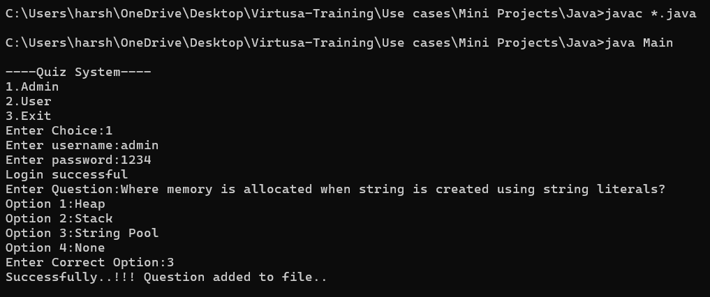
  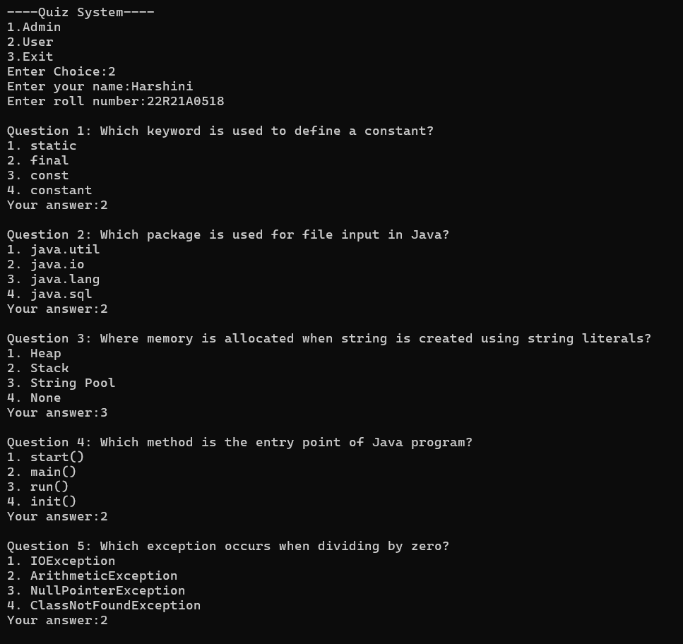
  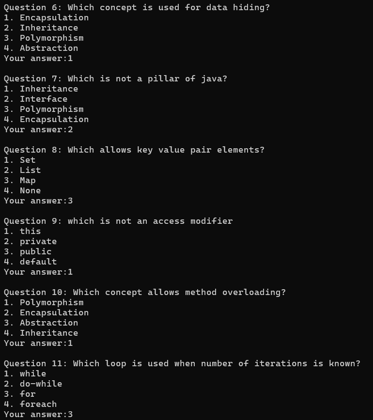
  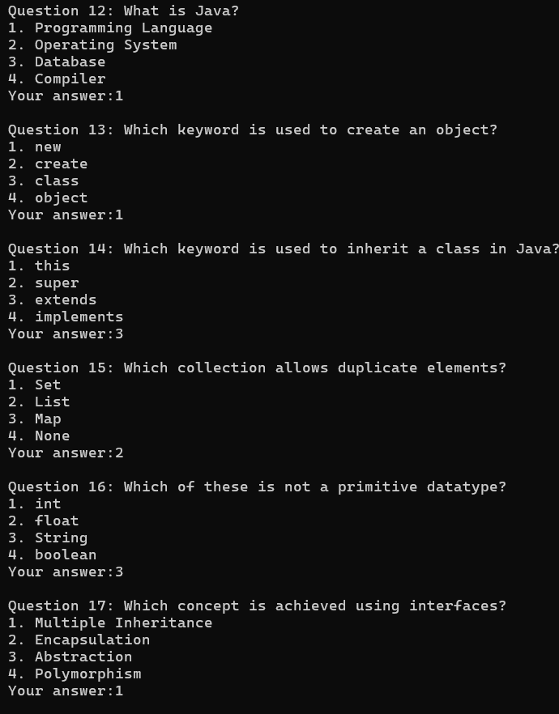
  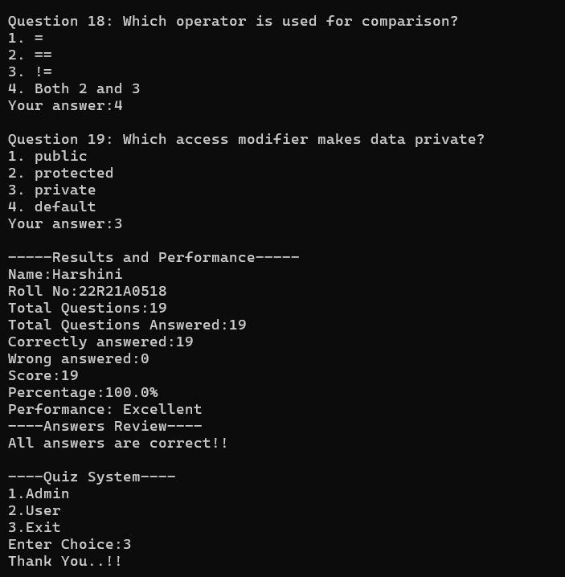
</p>

---

## SQL – Online Retail Sales Analysis

**Description:**
A relational database system to analyze retail sales and generate insights.

### Queries & Outputs

```sql
-- Top-selling products
SELECT p.product_name, SUM(ord_it.quantity) AS total_sold
FROM order_items ord_it
JOIN products p ON ord_it.product_id = p.product_id
GROUP BY p.product_name
ORDER BY total_sold DESC;
```

<p align="center">
  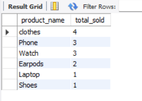
</p>

```sql
-- Most valuable customers
SELECT c.customer_name, SUM(p.price * oi.quantity) AS total_spent
FROM customers c
JOIN orders o ON c.customer_id = o.customer_id
JOIN order_items oi ON o.order_id = oi.order_id
JOIN products p ON oi.product_id = p.product_id
GROUP BY c.customer_name
ORDER BY total_spent DESC;
```

<p align="center">
  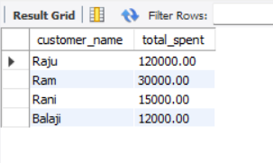
</p>

```sql
-- Monthly revenue
SELECT MONTH(o.order_date) AS month,
       SUM(p.price * oi.quantity) AS revenue
FROM orders o
JOIN order_items oi ON o.order_id = oi.order_id
JOIN products p ON oi.product_id = p.product_id
GROUP BY MONTH(o.order_date);
```

<p align="center">
  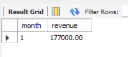
</p>

```sql
-- Category-wise sales
SELECT p.category, SUM(oi.quantity) AS total_sales
FROM order_items oi
JOIN products p ON oi.product_id = p.product_id
GROUP BY p.category;
```

<p align="center">
  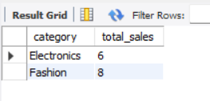
</p>

```sql
-- Inactive customers
SELECT customer_name
FROM customers
WHERE customer_id NOT IN (
    SELECT DISTINCT customer_id FROM orders
);
```

<p align="center">
  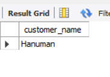
</p>

---

## Python – Smart Expense Tracker

**Description:**
A tool to track daily expenses and analyze spending behavior.

**Features:**

* Expense logging (date, category, amount)
* Monthly summary
* Category-wise analysis
* Visualization using charts

**Output:**

<p align="center">
  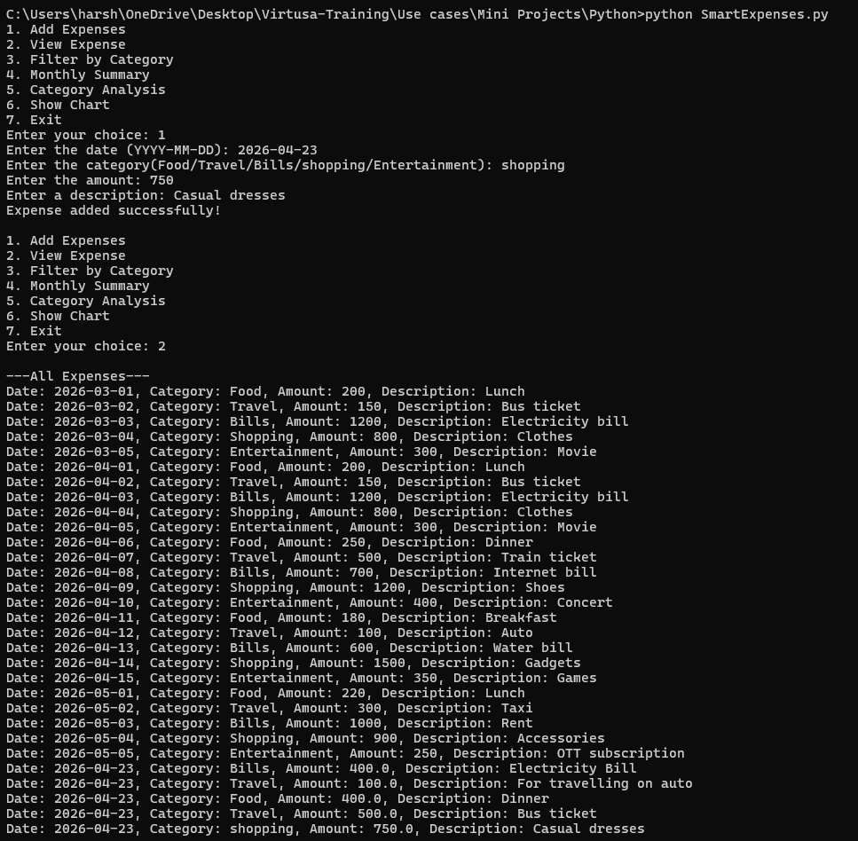
  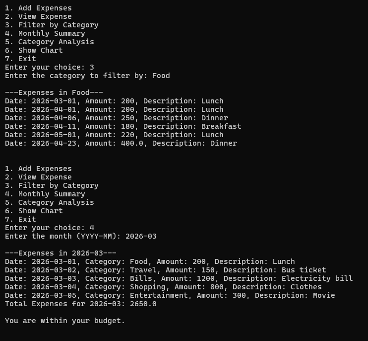
  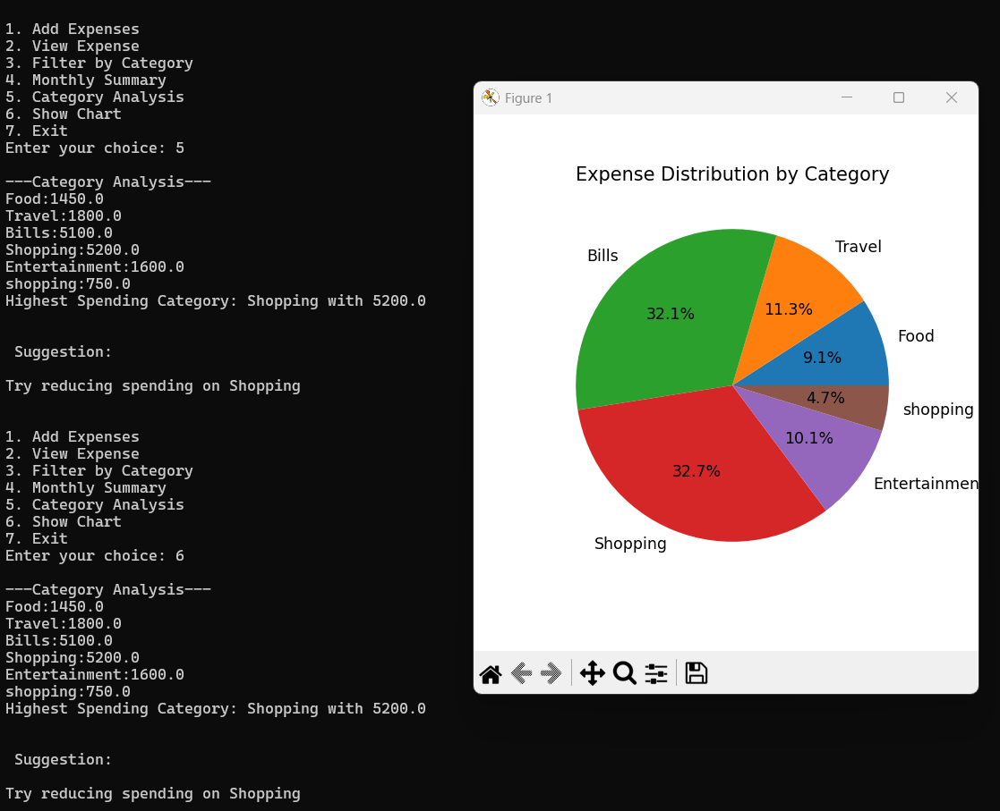
</p>

> Helps users understand spending patterns and optimize expenses

---

# Section 2: Mini Project Use Cases

---

## Java – SmartPay Utility Biller

**Description:**
A billing system that calculates electricity/water bills based on usage slabs.

**Features:**

* Slab-based billing system
* Input validation
* Interface-based design
* Digital receipt generation

**Output:**

<p align="center">
  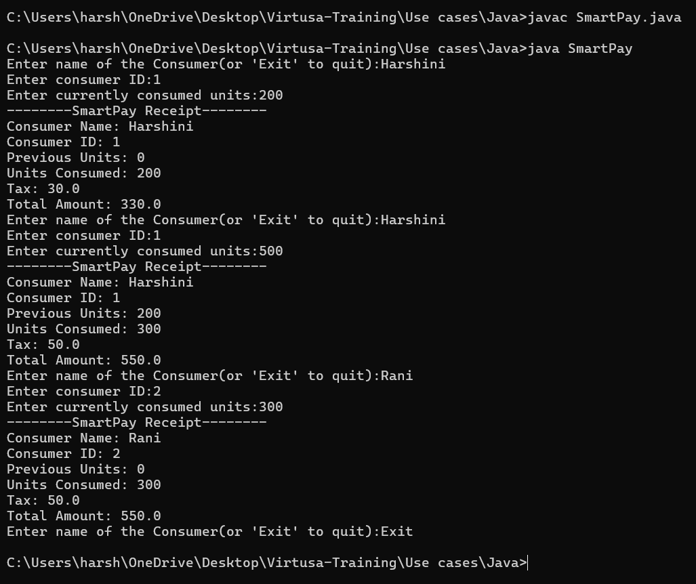
</p>

---

## SQL – E-Commerce Logistics Tracker

**Description:**
A logistics tracking system to monitor shipments and analyze delivery performance.

### Queries & Outputs

```sql
-- Delayed Shipment Delivery
SELECT *
FROM shipments
WHERE ActualDeliverDate > promisedDate;
```

<p align="center">
  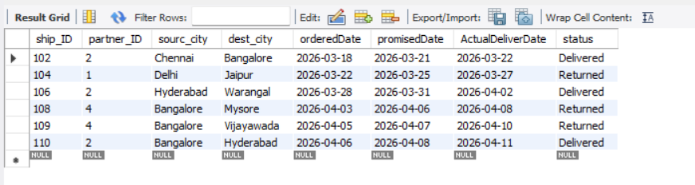
</p>

```sql
-- Performance Ranking
SELECT partner_ID,
       COUNT(CASE WHEN status = 'Delivered' THEN 1 END) AS Delivered,
       COUNT(CASE WHEN status = 'Returned' THEN 1 END) AS Returned
FROM shipments
GROUP BY partner_ID;
```

<p align="center">
  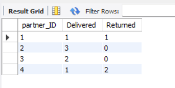
</p>

```sql
-- Zone filtering
SELECT dest_city, COUNT(*) AS TotalOrders
FROM shipments
WHERE orderedDate >= CURDATE() - INTERVAL 30 DAY
GROUP BY dest_city
ORDER BY TotalOrders DESC
LIMIT 1;
```

<p align="center">
  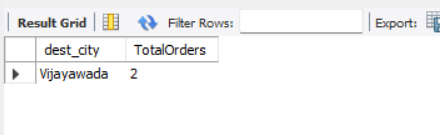
</p>

```sql
-- Performance scorecard
SELECT p.partner_name,
       COUNT(s.ship_ID) AS TotalShipments,
       COUNT(CASE WHEN s.ActualDeliverDate <= s.promisedDate THEN 1 END) AS OntimeDelivery,
       COUNT(CASE WHEN s.ActualDeliverDate > s.promisedDate THEN 1 END) AS DelayedDelivery,
       ROUND(
           (COUNT(CASE WHEN s.ActualDeliverDate <= s.promisedDate THEN 1 END) * 100.0) / COUNT(*),
           2
       ) AS SuccessRate
FROM partners p
JOIN shipments s ON p.partner_ID = s.partner_ID
GROUP BY p.partner_name
ORDER BY DelayedDelivery ASC;
```

<p align="center">
  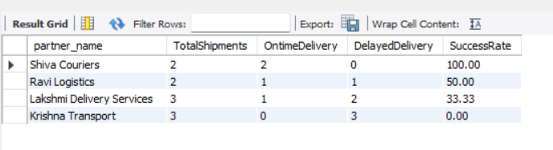
</p>

---

## Python – Social Media Content Sanitizer

**Description:**
A content moderation tool that filters harmful words and extracts links.

**Features:**

* Banned word filtering
* URL extraction
* Post analysis
* Summary report generation

**Output:**

<p align="center">
  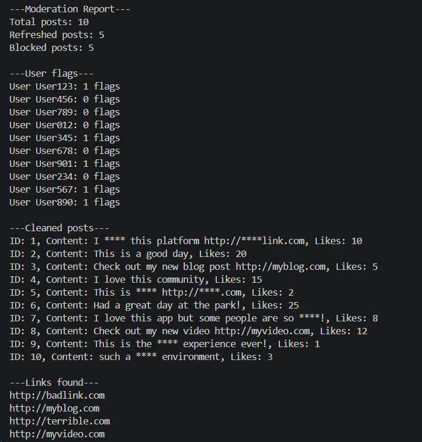
</p>

> Demonstrates automation of content filtering and safety mechanisms

---

## Project Structure

```
/project-root
│
├── Mini Projects/
│   ├── Java/
│   ├── SQL/
│   ├── Python/
│
├── UseCases/
│   ├── Java/
│   ├── SQL/
│   ├── Python/
│
├── outputs/
│   ├── Miniproject_Outputs/
│   ├── Usecase_Outputs/
│
└── README.md
```
